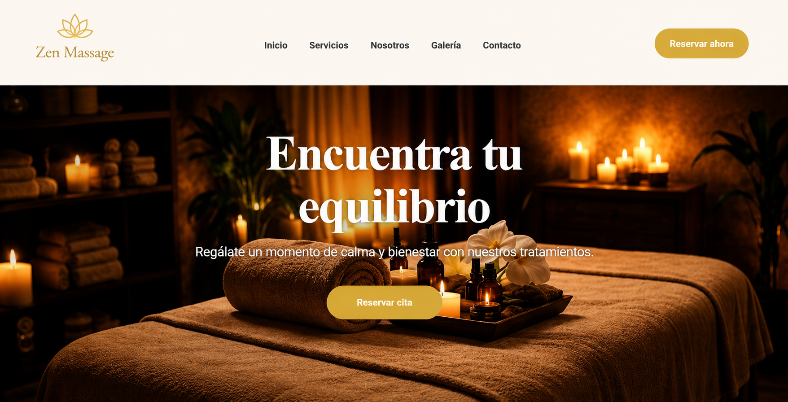

<p align="center">
  
</p>

# 💆 Zen Massage Booking

Aplicación **Full Stack** desarrollada con **React**, **JavaScript**, **Python**, **Flask**, **SQLAlchemy** y **APIs REST** para la gestión de reservas de un centro de masajes. El proyecto permite consultar servicios, conocer el equipo, reservar citas online y contactar con el centro mediante una interfaz moderna, intuitiva y responsive.

---

## 🚀 Tecnologías

### Frontend

- React
- JavaScript (ES6+)
- HTML5
- CSS3
- React Router
- Fetch API

### Backend

- Python
- Flask
- SQLAlchemy
- SQLite / PostgreSQL
- REST APIs
- JWT Authentication

### Herramientas

- Git
- GitHub
- VS Code
- GitHub Copilot
- Inteligencia Artificial

---

## ✨ Características

- 💆 Visualización de servicios de masaje.
- 📅 Sistema de reservas online.
- 🕒 Gestión de horarios disponibles.
- 👥 Presentación del equipo profesional.
- 📩 Formulario de contacto.
- 📱 Diseño responsive para ordenador, tablet y móvil.
- 🔗 Integración entre frontend y backend mediante APIs REST.
- 🗄️ Gestión de datos con SQLAlchemy.

---


## 🛠️ Instalación

### Clonar el repositorio

```bash
git clone https://github.com/beatriz24BCN/zen-massage-booking.git
cd zen-massage-booking
```

### Frontend

```bash
npm install
npm run dev
```

### Backend

```bash
pipenv install
pipenv run start
```

---

## 📂 Estructura del proyecto

```
📦 zen-massage-booking
├── frontend
│   ├── React
│   ├── Componentes
│   ├── Páginas
│   └── Estilos
│
├── backend
│   ├── Flask
│   ├── Models
│   ├── Routes
│   ├── APIs REST
│   └── SQLAlchemy
│
└── Base de datos
```

---

## 🤖 Desarrollo con Inteligencia Artificial

Este proyecto ha sido desarrollado aplicando herramientas de **Inteligencia Artificial**, como **GitHub Copilot** e **IA generativa**, para agilizar el desarrollo, optimizar el código, resolver incidencias y mejorar la productividad durante todo el proceso.

---

## 👩‍💻 Autora

**Beatriz Campos**

💼 LinkedIn  
https://www.linkedin.com/in/bea-campos-5670a633b

🐙 GitHub  
https://github.com/beatriz24BCN

📧 Email  
beatriz24bcn@hotmail.com

---

## 📌 Repositorio

https://github.com/beatriz24BCN/zen-massage-booking


